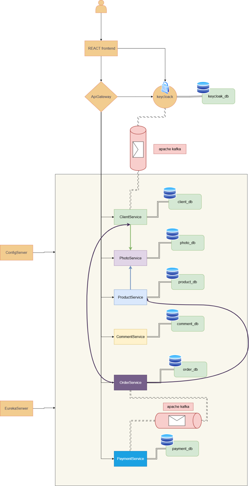

# GreenThreads Shop

It is a modern microservices based e-commerce web platform: scalable, secured, and event-driven.

---
## Project Overview

**GreenThreads Platform** is a web application built on a microservices architecture. Each service is responsible for a distinct business domain, communicates via REST (feign client) or Kafka events, and the ecosystem is containerized with Docker Compose. Access to resources is protected by **Keycloak**, and the user interface is built with **React** and **Bootstrap**.

---

## Architecture



---

## Tech Stack

| Layer                | Technology                                              |
|----------------------|---------------------------------------------------------|
| Frontend             | React, Bootstrap, Axios, React Router                   |
| Backend              | Java, Spring Boot, Spring Cloud                         |
| API Gateway          | Spring Cloud Gateway                                    |
| Authorization        | Keycloak, OAuth2, JWT                   |
| Message Broker       | Apache Kafka, Zookeeper                                 |
| Database             | PostgreSQL (per service)                                |
| Containerization     | Docker, Docker Compose                                  |
| Service Discovery    | Spring Cloud Eureka                                     |

---

## Prerequisites

Make sure you have the following installed before running the project:

- [Docker](https://www.docker.com/) - to start application
- [Node.js](https://nodejs.org/) - (optional for local developement)
- [Java 21](https://adoptium.net/) - (optional for local developement)
- [Maven](https://maven.apache.org/) - (optional for local developement)

---

## Getting Started

### 1. Clone the repository

```bash
git clone https://github.com/LunarSpectrum92/greenthreads-shop-spring-react.git
cd greenthreads-shop-spring-react
```

### 2. Configure environment variables

 - Place .env file in main working directory
```
CLIENT_POSTGRE_USERNAME
CLIENT_POSTGRE_PASS
COMMENT_POSTGRE_USERNAME
COMMENT_POSTGRE_PASS
ORDER_POSTGRE_USERNAME
ORDER_POSTGRE_PASS
PAYMENT_POSTGRE_USERNAME
PAYMENT_POSTGRE_PASS
PHOTO_POSTGRE_USERNAME
PHOTO_POSTGRE_PASS
PHOTO_PATH=/app/photos
PRODUCT_POSTGRE_USERNAME
PRODUCT_POSTGRE_PASS
```
 - Place .env file in ztpai-react-frontend
```
VITE_KEYCLOAK_URL
VITE_KEYCLOAK_REALM
VITE_KEYCLOAK_CLIENT
```

### 3. Start all services with Docker Compose

```bash
docker compose up --build
```

### 4. Access the application

| Service          | URL                   |
|------------------|-----------------------|
| Frontend (React) | http://localhost:5173 |
| API Gateway      | http://localhost:8222 |
| Payment Service  | http://localhost:9060 |
| Product Service  | http://localhost:9020 |
| Photo Service    | http://localhost:9030 |
| Client Service   | http://localhost:9010 |
| Comment Service  | http://localhost:9040 |
| Order Service    | http://localhost:9050 |
| Config Service   | http://localhost:9999 |
| Eureka Service   | http://localhost:8761 |

> **Default Keycloak Admin credentials:**  
> Username: `admin` | Password: `admin` *(change before any production deployment!)*

---

## Directory Structure

```
greenthreads-shop-spring-react
│
├── docker/      (Dockerfiles)              
│   ├── ApiGateway/
│   ├──  ClientService/
│   ├──  CommentService/
│   ├──  config-server/
│   ├──  eureka-server/
│   ├──  Frontend/   
│   ├──  OrderService/
│   ├──  PaymentService/
│   ├──  PhotoService/
│   └── ProductService/
├── providers/             
│   └── keycloakSpi-1.0-SNAPSHOT.jar   (custom keycloak configuration .jar)
├── FrontendService/                         
│   └── ztpai-react-frontend/
├── Services/
│   ├── ApiGateway/
│   ├──  ClientService/
│   ├──  CommentService/
│   ├──  config-server/
│   ├──  eureka-server/
│   ├──  KeycloakSpiEvent/    (custom keycloak configuration)
│   ├──  OrderService/
│   ├──  PaymentService/
│   ├──  PhotoService/
│   └── ProductService/
│
├── docker-compose.yml
    
```

---

## Microservices

### API Gateway (`api-gateway`)

The central entry point for all client requests. Responsible for:

- Routing requests to the appropriate services
- JWT token validation (Keycloak integration)
- Load balancing

### Client Service (`ClientService`)

- Manages user profiles. Exposes a REST API secured with Keycloak.

### Comment Service (`CommentService`)

- CommentService allows to create and manage comments. Exposes a REST API secured with Keycloak.

### Config Server (`config-server`)

- Is responsible for centralized configuration.

### Eureka Server (`eureka-server`)

- Discovery server.

### Order Service (`OrderService`)

- Manages orders, thanks to kafka provide event driven communication with PaymentService, Is secured with Keycloak.

### Payment Service (`PaymentService`)

- Manages user payment. Exposes a REST API secured with Keycloak.

### Photo Service (`PhotoService`)

- Manages user photos. Takes care about photo creation and distribution, properly sanitize photo paths. Exposes a REST API secured with Keycloak.

### Product Service (`ProductService`)

- Manages products. Exposes a REST API secured with Keycloak.

---

## Authorization & Authentication (Keycloak)

The project uses **Keycloak** as an Identity Provider following the **OAuth2** standard.

### Keycloak Setup

Keycloak has volume with KeycloakSpi jar. It allows to set up custom configuration of keycloak. 

### Spring Boot Configuration

Each service is secured as an **OAuth2 Resource Server**:

```yaml
  security:
    oauth2:
      resourceserver:
        jwt:
          jwk-set-uri: http://${KEYCLOAK_HOST:localhost}:7080/realms/eCommerce-realm/protocol/openid-connect/certs
          issuer-uri: http://localhost:7080/realms/eCommerce-realm

```
### System Roles

| Role         | Permissions                                      |
|--------------|--------------------------------------------------|
| `ROLE_User`  | Access to own account resources                  |
| `ROLE_Admin` | Full access to the administration panel          |

---

## Asynchronous Messaging (Kafka)

Apache Kafka handles asynchronous communication between services.

### Topics

| Topic                  | Producer      | Consumer(s)                           |
|------------------------|---------------|---------------------------------------|
| `OrderToPayment`        | OrderService  | PaymentService                 |
| `PaymentNotification`      | PaymentService | (currently none, future improvements) |
| `PaymentToOrder` | PaymentService | OrderService                          |
| `userData` | Keycloak      | ClientService                         |
---

## Frontend

The React + Bootstrap 5 application communicates with the backend through the API Gateway.

### Component Structure

```
src/
├── Components/
├── Contexts/
├── Css/
├── Hooks/
├── Pages/
├── Utils/
├── App.js
└── main.js
```

---
## Testing

### Backend (JUnit + Mockito + assertJ + Testcontainers)

 - **Unit tests**: Every class has over 80% of coverage in services layer. **Mockito**, **Junit**, **AssertJ**
 - **Integration tests**: only custom repository logic has incorporated integration test with use of testcontainers. **TestContainers**

---

## Application screen shots

**1. Main Page**


**2. Admin Page**


**3. Account Page**


**4. Order Page**


**5. Payment Page**


**6. Products Page**


**7. Product Page**


---

## 👤 Author

**Jarosław Konopka**

**GitHub: @LunarSpectrum92**